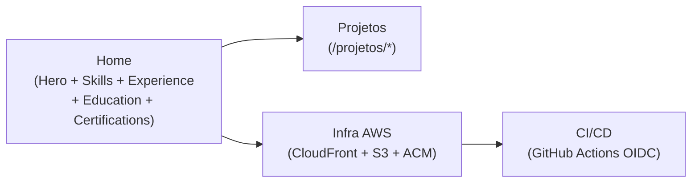

## Visão atômica

`marco-menezes.com` é o **portfólio técnico vivo** de Marco Aurélio Menezes — Data/AI Engineer. Mensagem central: *"Eu construo sistemas — venha ver."* O portfólio é tanto vitrine profissional quanto demonstração técnica auditável — qualquer visitante pode clicar para ver o repo, a infra (Terraform), os custos reais e as decisões.

Ambiente stage (`stage.marco-menezes.com`) operacional com infra OIDC + CloudFront + ACM provisionada via GitHub Actions. Go-live em produção (`marco-menezes.com`) aguarda release `prod-go-live-v1`.

## Usuários

| Usuário | Descrição |
|---------|-----------|
| Recrutadores | Recrutadores corporativos, tech, hiring managers em primeiro contato. Buscam validação rápida (10–30s) de senioridade, experiência, certificações, contato. |
| Comunidade técnica | Peers de engenharia, recrutadores técnicos avançados, contribuidores open source, alunos curiosos. Buscam evidência verificável de "como esse engenheiro pensa e constrói". |

## Catálogo de features

| Slug | Título | TL;DR |
|------|--------|-------|
| [overview](overview.md) | Product Overview | O que é o portifolio, mensagem central, features P0 entregues e estado atual. |
| [personas](personas.md) | Personas | Recrutadores e comunidade técnica; como o site atende cada um. |
| [quality-bar](quality-bar.md) | Quality Bar | Critérios de "pronto" do P0, Lighthouse, i18n, custo e segurança operacional. |

## Mapa de capacidades

## Limites conhecidos

- P1 (CMS-lite Lambda Go + Cognito) não implementado — apenas especificado.
- Idioma `de` em modo manutenção — fallback automático para `en` quando chave faltar.
- Go-live em produção (`marco-menezes.com`) aguarda release `prod-go-live-v1`.
- Sem multi-region, WAF, testes de carga/mutação, dashboard de custo em tempo real.
